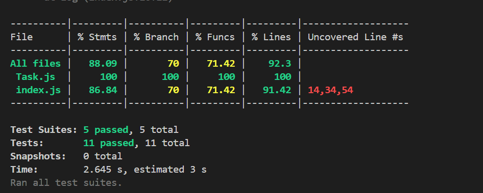

# 🧪 Task Manager API — Testing Suite Overview

This repository includes a fully tested Node.js + Express API for managing tasks. It demonstrates **unit testing (with and without mocking)**, **integration testing**, and **API endpoint testing**—with over 90% test coverage using in-memory MongoDB.

---

## 🌐 API Overview

| Method | Endpoint       | Description               |
|--------|----------------|---------------------------|
| GET    | `/tasks`       | Fetch all tasks           |
| POST   | `/tasks`       | Create a new task         |
| PUT    | `/tasks/:id`   | Update a task by ID       |
| DELETE | `/tasks/:id`   | Delete a task by ID       |

---

## 🧰 Tech Stack

- **Node.js + Express**
- **MongoDB (via Mongoose)**
- **mongodb-memory-server** (for testing DB in-memory)
- **Supertest** (for route testing)
- **Jest** (as the test runner)

---

## 🚀 How to Run

### 1. Install dependencies
```bash
npm install
```

### 2. Start the local server
```bash
node server.js
```

This will connect to MongoDB at `mongodb://localhost:27017/tasksDB` and launch the API at [http://localhost:3000](http://localhost:3000).

---

## 🧪 Running Tests

Run full test suite with coverage:
```bash
npm test
```

This command runs all tests across unit, integration, and API folders and outputs a test coverage summary.

---

## 🧱 Testing Tools Used

- **jest** — for assertions, mocking, and coverage
- **supertest** — for simulating HTTP requests
- **mongodb-memory-server** — for isolated integration and API testing without touching local DB
- **mongoose** — for data modeling

---

## ✅ Test Coverage

Here’s a screenshot of the final coverage report:



---

## 📝 Notes

- Routes are protected against invalid IDs and missing fields.
- Tests include edge case handling and intentional validation errors.
- You can explore the `tests/` folder to see how each test