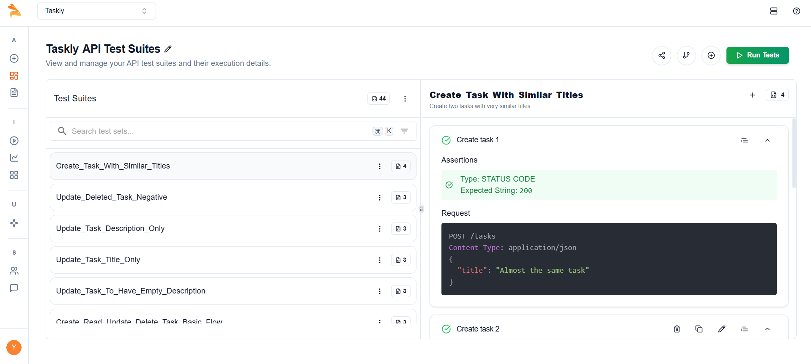
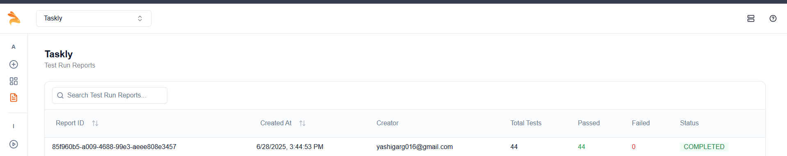

# 🚀 Keploy API Testing & CI/CD Integration

This project showcases API testing using **Keploy** with both AI-driven test generation and Chrome extension workflows, integrated into a full **CI/CD pipeline with GitHub Actions**.

---

## 📘 Project Overview

A simple Express.js backend for managing tasks, using **MongoDB** for persistence. Built for demonstrating:

- OpenAPI schema generation
- AI-based test case generation via [Keploy](https://keploy.io/)
- Automated test execution within a CI/CD pipeline
- Chrome Extension-based traffic capture and test generation
- Frontline debugging, validation, and learning 😎

---

## 🧪 Task 1: API Testing with AI & CI/CD

### ✅ OpenAPI Schema

The full OpenAPI schema for the Task API was defined and uploaded into the Keploy test generator.

### ✅ Test Generation via cURL + Schema

Test cases were generated using:

- Paste cURL commands (manually generated)
- Uploaded OpenAPI Schema
- Captured test cases in [Keploy Dashboard](https://app.keploy.io)

---

### 🖼️ Keploy Test Suite Screenshot

Below is a screenshot of the test case suites generated and managed by the Keploy agent:


---

### ✅ CI/CD Pipeline with GitHub Actions

A custom GitHub Actions workflow was created to install dependencies, spin up the server, and run Keploy tests in every push to `api-testing`.

```yaml
# .github/workflows/ci.yml
name: Keploy API CI

on:
  push:
    branches: [ main, api-testing ]

jobs:
  test:
    runs-on: ubuntu-latest
    services:
      mongo:
        image: mongo:latest
        ports:
          - 27017:27017
    steps:
      - uses: actions/checkout@v3
      - name: Install Node.js
        uses: actions/setup-node@v3
        with:
          node-version: '18'
      - run: npm install
      - name: Start server in background
        run: nohup node server.js &
      - name: Run Keploy tests
        run: keploy test -c "node server.js"
```

---

## 📊 Test Reports

- All test results and coverage are available in the Keploy dashboard.
  
  


---

## 📝 Notes

- Keploy enables both AI-based and real-traffic-based test generation, making regression testing seamless.
- The CI/CD workflow ensures every code push is validated against all generated test cases.
- For more details on Keploy, visit [keploy.io](https://keploy.io/).

---
